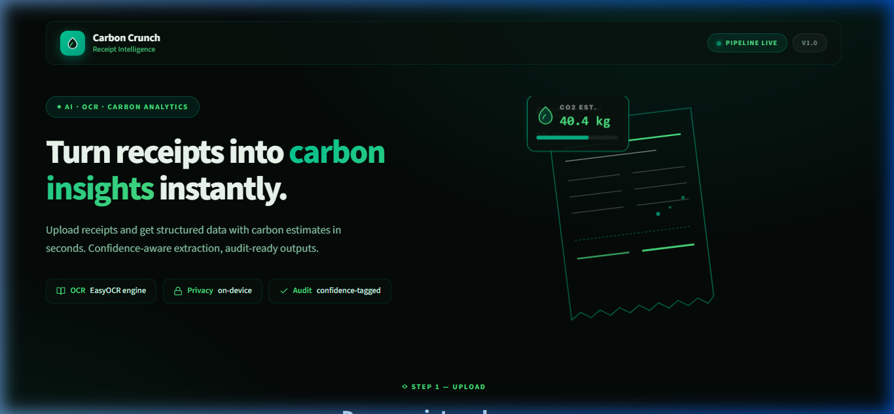
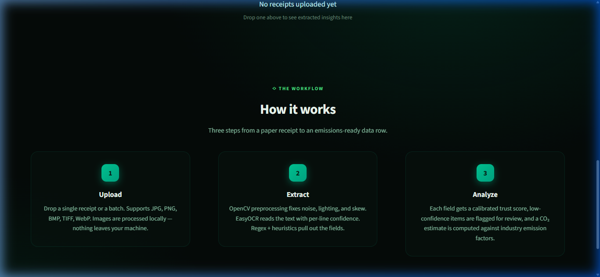
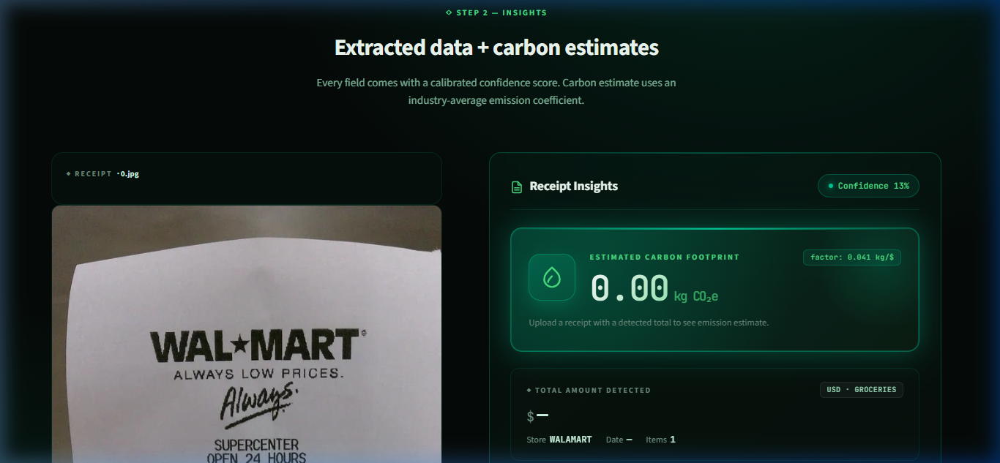

# Carbon Crunch — AI Receipt Intelligence

> **Shortlisting Assignment** — submitted by **Tirupathamma Guntru**  
> (tirupathammaguntru@gmail.com)



Carbon Crunch is an end-to-end AI pipeline that transforms raw receipt images into structured, **confidence-aware** financial data. It features a robust batch processing engine and a premium Streamlit dashboard for real-time analytics.

---

## 🚀 How it Works

The system follows a three-step intelligence pipeline to ensure maximum accuracy even with low-quality scans.



### 1. Advanced Preprocessing (OpenCV)
Before OCR, the image undergoes a conservative enhancement suite:
* **CLAHE Contrast Tuning:** Fixes uneven lighting and shadows without destroying text edges.
* **Non-Local Means Denoising:** Removes sensor noise while keeping characters crisp.
* **Auto-Deskew:** Detects skew angles via `minAreaRect` and rotates the image to a perfect vertical alignment.
* **Adaptive Resizing:** Upscales small receipts to a 1500px target height to improve OCR char-detection.

### 2. Multi-Engine OCR (EasyOCR)
Utilizes **EasyOCR** (CRAFT + ResNet) to extract text with per-line confidence scores. This allows the system to differentiate between "certain" extractions and "best guesses."

### 3. Intelligent Extraction (Regex + Heuristics)
Our custom extraction engine parses the OCR results to identify:
* **Store Name:** Fuzzy-matched against common vendor patterns.
* **Date:** Robust parsing for US (MM/DD/YY) and International (DD/MM/YY) formats.
* **Line Items:** Extracts descriptions and prices, stripping UPC codes and transaction artifacts.
* **Total Amount:** Anchored by keyword proximity (e.g., "Grand Total", "Total Due") with fallback to the maximum price detected.

---

## 📊 Streamlit Dashboard

The repository includes a premium web interface for interacting with the pipeline.



* **Real-time Processing:** Upload a receipt and see the extraction in seconds.
* **Carbon Analytics:** Estimates CO2 impact based on store categories.
* **Confidence Highlighting:** Fields with low trust scores (<0.7) are visually flagged for human audit.

---

## 📂 Repository Structure

```text
Intern/
├── main.py                  # Batch processing CLI
├── app.py                   # Streamlit Web Interface
├── src/
│   ├── preprocess.py        # Image enhancement logic
│   ├── ocr.py               # EasyOCR wrapper
│   ├── extractor.py         # Field parsing (Dates, Totals, Items)
│   ├── confidence.py        # Multi-signal trust scoring
│   └── summary.py           # Financial aggregation
├── docs/
│   └── images/              # Visual assets for documentation
└── data/receipts/           # Input directory for batch processing
```

---

## 🛠️ Quick Start Procedure

### 1. Environment Setup
```bash
# Clone and enter the repository
cd Intern

# Create and activate virtual environment
python -m venv venv
venv\Scripts\activate  # Windows
source venv/bin/activate  # macOS/Linux

# Install dependencies
pip install -r requirements.txt
```

### 2. Running Batch Processing (CLI)
Drop your images in `data/receipts/` and run:
```bash
python main.py --input "data/receipts"
```
Structured results will be saved to `outputs/json/` and a portfolio summary to `outputs/summary.json`.

### 3. Launching the Web Interface (UI)
```bash
streamlit run app.py
```
Open your browser to `http://localhost:8501` to use the interactive dashboard.

---

## 🔍 Confidence & Auditing

Every extracted field carries a **Confidence Score (0.0 – 1.0)**.
* **Green:** High confidence (>0.85). Ready for automated entry.
* **Amber:** Medium confidence (0.70 – 0.85). Monitor for errors.
* **Red:** Low confidence (<0.70). Flagged for human review in `low_confidence_flags`.

---

## 📄 License
Submitted as part of the Carbon Crunch shortlisting assignment.
